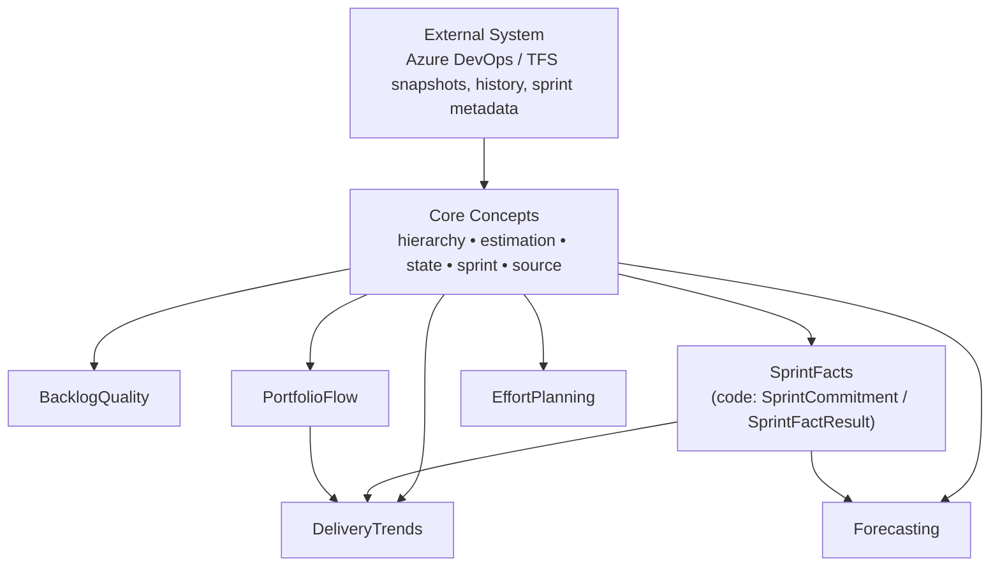

# CDC Domain Map — Generated

_Generated from canonical domain source files on 2026-03-17._

Reference documents:

- `docs/domain/cdc_domain_map.md`
- `docs/domain/cdc_reference.md`

## Generation Metadata

- Generation date: 2026-03-17
- Detected CDC slices:
  - `BacklogQuality`
  - `SprintFacts` (`PoTool.Core.Domain.Cdc.Sprints`, implemented today through `SprintCommitment` + `SprintFactResult`)
  - `PortfolioFlow`
  - `DeliveryTrends`
  - `Forecasting`
  - `EffortPlanning`
- Service count: 27 public service interfaces across the detected slices
- Scan note: `PoTool.Core.Domain/Domain/Cdc/` currently exposes only the sprint slice; the remaining canonical slices live in sibling domain namespaces and are included here so the generated map matches the real architecture rather than only the `Domain/Cdc` folder.

## Mermaid Diagram



Diagram intent:

- `External System` collapses the raw snapshot, history, and sprint-metadata feeds into one source node for the requested canonical view.
- `SprintFacts` is the issue-facing slice name; the concrete code is `PoTool.Core.Domain.Cdc.Sprints` with `SprintCommitment` records and `SprintFactResult`.
- The cross-slice arrows are the canonical architecture relationships required for the generated view. The concrete service-interface dependencies are listed separately below.

## Simplified Architecture Diagram

```text
External System
        ↓
Core Concepts
        ↓
+----------------+----------------+----------------+----------------+----------------+----------------+
| BacklogQuality |  SprintFacts   | PortfolioFlow  | DeliveryTrends |  Forecasting   | EffortPlanning |
+----------------+----------------+----------------+----------------+----------------+----------------+

Cross-slice relationships:
- SprintFacts -> DeliveryTrends
- SprintFacts -> Forecasting
- PortfolioFlow -> DeliveryTrends
```

## Service Dependency Map

### Core Concepts

Canonical domain inputs shared by every slice:

- `CanonicalWorkItem`
- `WorkItemSnapshot`
- `SprintDefinition`
- `FieldChangeEvent`
- `StateClassification`
- domain rules from `docs/domain/domain_model.md` and `docs/domain/rules/*.md`

Repository-shared math helpers used where the contract is slice-independent:

- `StatisticsMath.Mean`
- `StatisticsMath.Median`
- `StatisticsMath.Variance`
- `StatisticsMath.StandardDeviation`

### BacklogQuality

- Source roots:
  - `PoTool.Core.Domain/BacklogQuality/Services`
  - `PoTool.Core.Domain/BacklogQuality/Models`
- Service interfaces:
  - no public slice service interface detected in `BacklogQuality/Services`
  - façade entrypoint: `BacklogQualityAnalyzer`
  - supporting rule contract: `IBacklogQualityRule`
- Domain models:
  - `BacklogGraph`
  - `WorkItemSnapshot`
  - `BacklogReadinessScore`
  - `ReadinessOwnerState`
- Result objects:
  - `ValidationRuleResult`
  - `BacklogIntegrityFinding`
  - `RefinementReadinessState`
  - `ImplementationReadinessState`
  - `BacklogValidationResult`
  - `BacklogQualityAnalysisResult`

### SprintFacts

- Source root:
  - `PoTool.Core.Domain/Domain/Cdc/Sprints`
- Service interfaces:
  - `ISprintCommitmentService`
  - `ISprintScopeChangeService`
  - `ISprintCompletionService`
  - `ISprintSpilloverService`
  - `ISprintExecutionMetricsCalculator`
  - `ISprintFactService`
- Domain models:
  - `SprintDefinition`
  - `FieldChangeEvent`
  - `WorkItemSnapshot`
  - `CanonicalWorkItem`
  - `StateClassification`
- Result objects:
  - `SprintCommitment`
  - `SprintScopeAdded`
  - `SprintScopeRemoved`
  - `SprintCompletion`
  - `SprintSpillover`
  - `SprintFactResult`

### PortfolioFlow

- Source root:
  - `PoTool.Core.Domain/Domain/Portfolio`
- Service interfaces:
  - `IPortfolioFlowSummaryService`
- Domain models:
  - `PortfolioFlowTrendRequest`
  - `PortfolioFlowSprintInfo`
  - `PortfolioFlowProjectionInput`
- Result objects:
  - `PortfolioFlowSummaryResult`
  - `PortfolioFlowTrendSummaryResult`
  - `PortfolioFlowTrendResult`

### DeliveryTrends

- Source root:
  - `PoTool.Core.Domain/Domain/DeliveryTrends`
- Service interfaces:
  - `IDeliveryProgressRollupService`
  - `IEpicAggregationService`
  - `IEpicProgressService`
  - `IFeatureForecastService`
  - `IFeatureProgressService`
  - `IInsightService`
  - `IPlanningQualityService`
  - `ISprintDeliveryProjectionService`
  - `IPortfolioDeliverySummaryService`
  - `IPortfolioSnapshotComparisonService`
  - `IPortfolioSnapshotFactory`
  - `IPortfolioSnapshotValidationService`
  - `IProductAggregationService`
  - `ISnapshotComparisonService`
- Domain models:
  - `DeliveryTrendWorkItem`
  - `DeliveryTrendResolvedWorkItem`
  - `SprintDeliveryProjectionRequest`
  - `SprintDeliveryProgressionRequest`
  - `DeliveryFeatureProgressRequest`
  - `DeliveryEpicProgressRequest`
  - `PortfolioDeliveryProductProjectionInput`
  - `PortfolioFeatureContributionInput`
  - `PortfolioDeliverySummaryRequest`
- Result objects:
  - `FeatureProgressResult`
  - `SprintDeliveryProjection`
  - `SprintTrendMetrics`
  - `ProgressionDelta`
  - `FeatureProgress`
  - `EpicProgress`
  - `ProductDeliveryProgressSummary`
  - `PortfolioDeliverySummaryResult`
  - `PortfolioProductDeliverySummaryResult`
  - `PortfolioFeatureContributionSummaryResult`

### Forecasting

- Source root:
  - `PoTool.Core.Domain/Domain/Forecasting`
- Service interfaces:
  - `ICompletionForecastService`
  - `IVelocityCalibrationService`
  - `IEffortTrendForecastService`
- Domain models:
  - `HistoricalVelocitySample`
  - `VelocityCalibrationSample`
  - `VelocityCalibrationEntry`
  - `EffortDistributionWorkItem`
  - `EffortSprintTrend`
  - `EffortAreaPathTrend`
  - `EffortDistributionForecast`
  - `ForecastConfidenceLevel`
  - `EffortForecastDirection`
- Result objects:
  - `DeliveryForecast`
  - `CompletionProjection`
  - `VelocityCalibration`
  - `EffortDistributionAnalysis`

### EffortPlanning

- Source root:
  - `PoTool.Core.Domain/Domain/EffortPlanning`
- Service interfaces:
  - `IEffortDistributionService`
  - `IEffortEstimationQualityService`
  - `IEffortEstimationSuggestionService`
- Domain models:
  - `EffortPlanningWorkItem`
- Result objects:
  - `EffortDistributionResult`
  - `EffortAreaDistributionResult`
  - `EffortIterationDistributionResult`
  - `EffortHeatMapCellResult`
  - `EffortEstimationQualityResult`
  - `EffortTypeQualityResult`
  - `EffortQualityTrendResult`
  - `EffortEstimationSuggestionResult`
  - `EffortHistoricalExampleResult`

### Concrete service-interface relationships in code today

- `ISprintDeliveryProjectionService` consumes sprint-history semantics through `ISprintCompletionService` and `ISprintSpilloverService`, plus core concepts via `ICanonicalStoryPointResolutionService` and `IHierarchyRollupService`.
- `IPortfolioDeliverySummaryService` consumes prepared `PortfolioDeliverySummaryRequest` rows and does not directly reference sprint CDC service interfaces.
- `ICompletionForecastService`, `IVelocityCalibrationService`, and `IEffortTrendForecastService` consume prepared historical samples and shared statistics rather than directly referencing `ISprintFactService`.
- `IEffortEstimationQualityService` and `IEffortEstimationSuggestionService` use `StatisticsMath` for slice-local computations.
- `IPortfolioFlowSummaryService` consumes prepared `PortfolioFlowTrendRequest` rows and does not directly reference `ISprintFactService`.

## Drift Warning Against `docs/domain/cdc_domain_map.md`

Warning: the generated map does not exactly match the existing hand-maintained map.

Detected differences:

- The generated map follows the issue scope and focuses on six requested slices. `docs/domain/cdc_domain_map.md` also models `EffortDiagnostics`, `Shared Statistics`, `Application Adapters`, `Projection Persistence`, and `UI and Client Consumers`.
- The generated map uses the issue label `SprintFacts`; `docs/domain/cdc_domain_map.md` uses the current code-facing label `SprintCommitment`. The underlying concrete source is the same `PoTool.Core.Domain.Cdc.Sprints` slice.
- The generated map collapses `Raw Work-Item Snapshots`, `Raw Work-Item History`, and `Sprint Metadata` into a single `External System` node. `docs/domain/cdc_domain_map.md` keeps those sources as separate nodes.
- The generated map inventories concrete service interfaces, domain models, and result objects. `docs/domain/cdc_domain_map.md` describes ownership, edges, and layering textually without listing the concrete type inventory.
- A strict scan of `PoTool.Core.Domain/Domain/Cdc/` would only discover the sprint slice today. The generated map broadens the scan to the stable sibling namespaces that currently implement the canonical CDC architecture: `BacklogQuality`, `Portfolio`, `DeliveryTrends`, `Forecasting`, and `EffortPlanning`.
- The required conceptual relationship `SprintFacts -> Forecasting` is shown in the generated view. The current codebase exposes forecasting through prepared historical samples rather than a direct `ISprintFactService` dependency, so this edge is conceptual rather than a direct service-interface reference.
- The required conceptual relationship `PortfolioFlow -> DeliveryTrends` is shown in the generated view. The current codebase does not expose that relation as a direct service-interface dependency.
